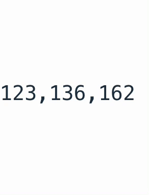

<a href="https://www.npmjs.com/package/react-animated-numbers">

</a>
<a href="https://www.npmjs.com/package/react-animated-numbers">

</a>

# react-animated-numbers

Library showing animation of number changes in react.js

## Props

|      name       |               type               | default | description                                                                                                                                    |
| :-------------: | :------------------------------: | :-----: | ---------------------------------------------------------------------------------------------------------------------------------------------- |
| animateToNumber |              number              |  none   | Number to be animated                                                                                                                          |
|    fontStyle    |       React.CSSProperties?       |  none   | Style of number text                                                                                                                           |
|  includeComma   |             boolean?             |  false  | A value that determines whether to show a comma or not.                                                                                        |
|     locale      |             string?              |  en-US  | Formats animated number as per locale. Also it should be used with `inculdeComma` prop. For list of locales, search for "BCP 47 language tags" |
|   transitions   | (index: number) => Transition$1? |  none   | framer-motion [transitions](https://www.framer.com/motion/transition/). The order of numbers shown is passed as a parameter.                   |
|    className    |             string?              |  none   | ClassName for style                                                                                                                            |

### Next JS (< v13.x.x )

You have to use dynamic imports to ensure that this library is imported on the client side only.

Import the library like this:

```
import dynamic from "next/dynamic";
const AnimatedNumbers = dynamic(() => import("react-animated-numbers"), {
  ssr: false,
});
```

Credit to @jedwardblack for [this](https://github.com/heyman333/react-animated-numbers/issues/40)

### Next JS (>= v13.x.x )

Use the library like this:

```
"use client";

import AnimatedNumbers from "react-animated-numbers"
```

### Example

```jsx
import React from "react";
import AnimatedNumbers from "react-animated-numbers";
import "./App.css";

function App() {
  const [num, setNum] = React.useState(331231);
  return (
    <div className="container">
      <AnimatedNumbers
        includeComma
        className={styles.container}
        transitions={(index) => ({
          type: "spring",
          duration: index + 0.3,
        })}
        animateToNumber={number}
        fontStyle={{
          fontSize: 40,
          color: "red",
        }}
      />
      <div>
        <button onClick={() => setNum((state) => state + 31234)}>+</button>
        <button onClick={() => setNum((state) => state - 31234)}>-</button>
      </div>
    </div>
  );
}

export default App;
```

### GIF



## Todo

- [ ] test code
- [x] start animation when dom is visible
